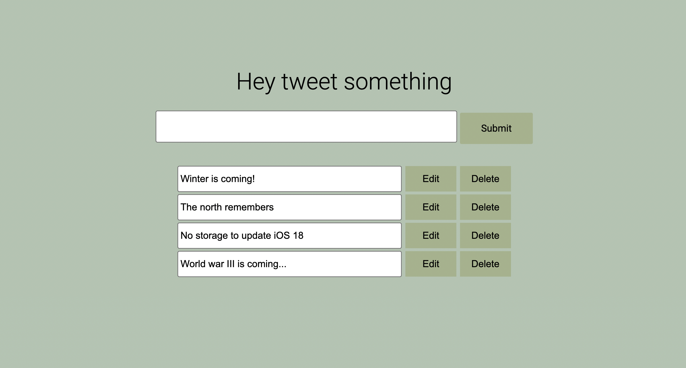
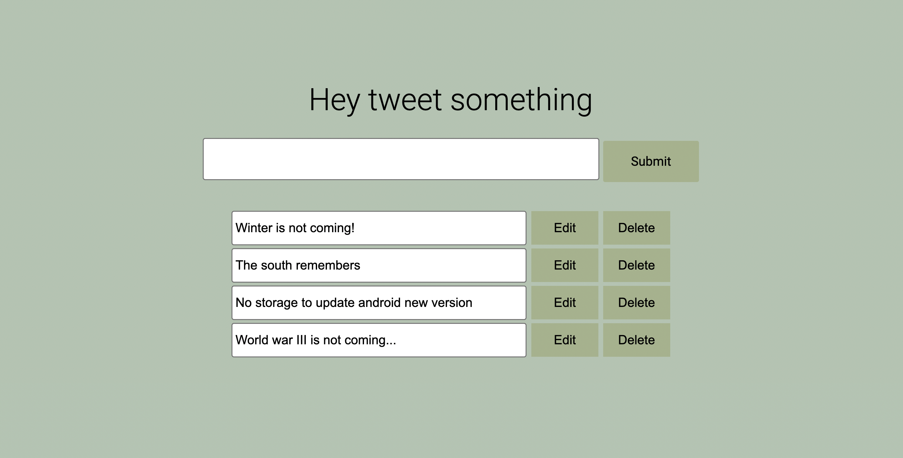
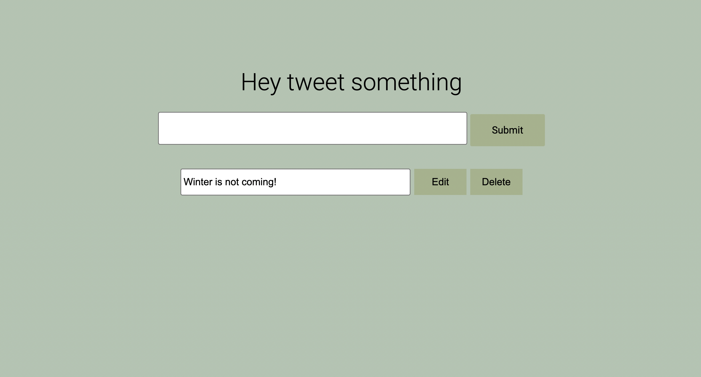

# BlogWebApplication
This app is a simple tweet management system built with Express.js. It allows users to create, edit, and delete tweets, storing them temporarily in memory. The main page displays the list of tweets, and changes are handled via form submissions.
-------Shared Tweets------

-------Edited Tweets------

-------Deleted Tweets------

